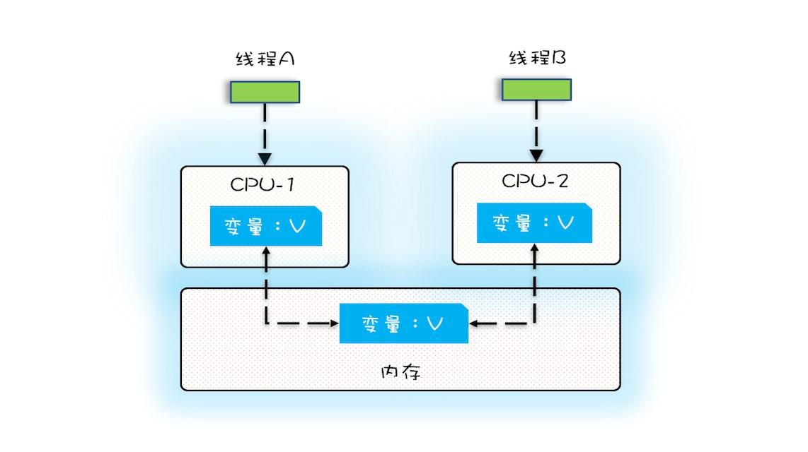
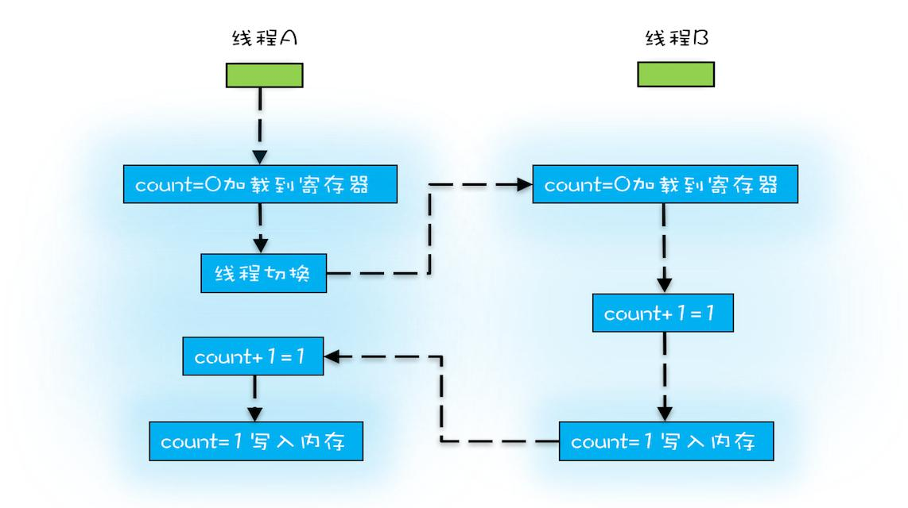
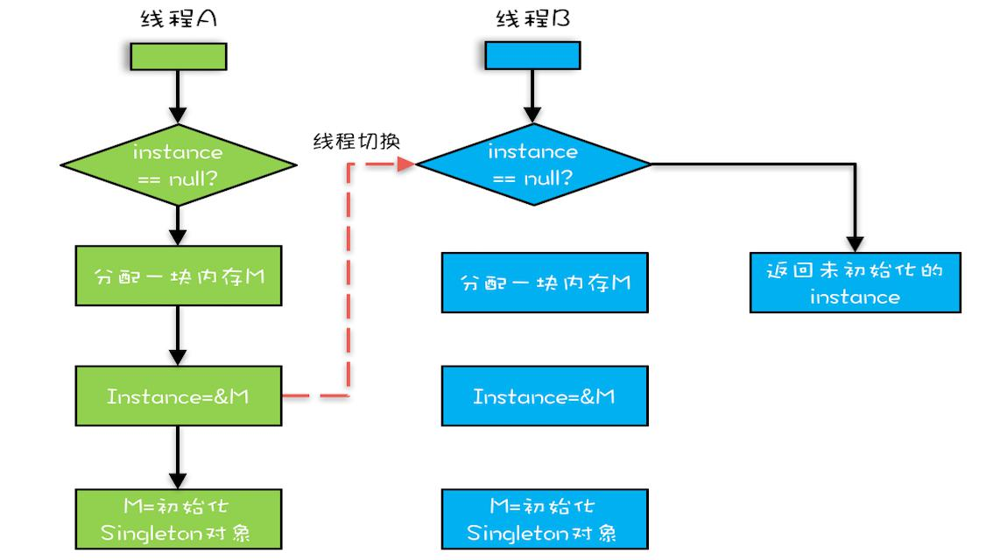

# 并发问题的源头

> 本文绝大部分内容来源于极客时间上王宝令大佬的Java并发编程实战.

## 背景

了解过计算机的人都知道,计算机`CPU - 内存 - IO设备`三者有较大的速度差异.
为了减少速度的差异,就有了缓存(cache),线程,进程等.
更大程度上让计算机多工作.更加好地利用计算机的计算能力.

在并发编程中由于操作系统,硬件设备和编译器的种种优化,会导致一些问题看起来有些诡异.

主要有三个方面分别是

- 可见性
- 原子性
- 有序性


## 可见性

可见性:CPU缓存(cache),加快了CPU与内存之间的交互,但是也引发了可见性问题.
尤其是在多核CPU中,每个CPU都有自己的cache,每个cache都有一份数据.

当程序并发时,很有可能会出现当在`CPU1`中的变量a的值修改了,但是`CPU2`中的a并不能看到在`CPU1`中a的值
的变化.

就像你爸(CPU1)和你妈(CPU2),都给你打钱(变量a).
每月初父母给你1000
到了月初了,你爸给你打了1000,可是你妈不知道(你爸打的1000没有及时通知到),又给你打了1000.
原本1000就行,这下可好2000了.

当然了,咱么在这里开玩笑,没啥.
但是程序要是出了这种bug,还是很可怕的.

我感觉这个和数据库中的读未提交的事务隔离级别类似.
可以做一下类比.数据库中的事务的ACID



图中所示,当多个CPU去共享同一个变量时,就容易出现可见性问题.

当不同CPU中的缓存存贮不同数值的a,然后进行操作后,再写入内存中去.
由于可见性问题,会导致问题出现.看下面的代码.结果可能是啥?

```java
public class Add10K {
	private void add() {
	private int num = 0;
		for (int i = 0; i < 10000; i++) {
			num++;
		}
	}
	public static void main(String[] args) {
		final Add10K test = new Add10K();
		Thread th1 = new Thread(()->{
			test.add();
		Thread th2 = new Thread(()->{
		});
			test.add();
		});
		th1.start();
		th2.start();
		try {
			th1.join();
			th2.join();
		} catch (InterruptedException e) {
			e.printStackTrace();
		}
		System.out.println(test.num);
	}
}
```

结果:并不确定大概在10000左右,但是肯定不会到达20000.


## 原子性

原子行问题是由线程切换导致的.
高级语言的一行代码可能是多行CPU的操作

来先看一行代码

```java
num += 1;
```
一行代码,在我之前的印象里,应该就是最小的单位了.
应该是原子性的.但是呢,程序最终还是得让CPU去执行.

然而,在CPU中,这一行代码就变成了三行.

- 取到num的值
- 将num+1
- 把num的值写入内存

CPU的执行的分时复用的,也就是说可能在执行上述三行CPU操作的时候,
线程可能被挂载,然后去执行另一个线程去.

也就是可能在num+1后,另一个线程又去执行num加1.导致程序出现问题.



## 有序性

有序性:编译器优化代码,导致代码的执行顺序不同

例如
```java
int a = 0;
// ...省略很多行代码
a = a + 5;
```

如果了解过一点编译原理,应该知道.代码在执行前,是需要优化的.
去掉没有使用的代码.把相近的操作连在一起.
上面的代码,编译器会把有关a的操作连在一起.这样更好地利用缓存.

```java
int a = 0;
a = a + 5;
// ...
```
----

我们来看一个`经典案例`,单例模式

```java
public class Singleton {
	// 这里可以加上 volatile 可以保证有序性和可见性,但不能保证原子性
  static Singleton instance;
  static Singleton getInstance(){
    if (instance == null) {
      synchronized(Singleton.class) {
        if (instance == null)
          instance = new Singleton();
        }
    }
    return instance;
  }
}
```

>现在一般使用静态内部类的方法来实现单例模式.

在多线程中`getInstance()`执行时

- 取instance	
	- 如果为null,进入下一步
	- 不为空,返回
- 为null,先吧Singleton这个类锁住,再次判断instance是否为空
	- 如果为空,new 一个对象返回
	- 不为空,返回


### 为什么还要判断一次是否为空呢?

JVM会保证只有一个线程获得锁,假如线程A获得了锁,它new了对象返回了.
然后,线程B获得了锁,它就得判断一下,是否有线程new了.不然就重复新建对象了

### 这样创建存在问题

存在
```java
	instance = new Singleton();
```
这一行分对于CPU来讲，有3个指令：
1.分配内存空间
2.初始化对象
3.instance引用指向内存空间
正常执行顺序1-2-3
但是CPU重排序后执行顺序可能为1-3-2，那么问题就来了
步骤如下：
1.A、B线程同时进入了第一个if判断
2.A首先进入synchronized块，由于instance为null，所以它执行instance = new Singleton();
3.然后线程A执行1-> JVM先画出了一些分配给Singleton实例的空白内存，并赋值给instance
4.在还没有进行第三步（将instance引用指向内存空间）的时候，线程A离开了synchronized块
5.线程B进入synchronized块，读取到了A线程返回的instance，此时这个instance并未进行物理地址指向，是一个空对象。

有人说将对象设置成volatile，其实也不能完全解决问题。volatile只是保证可见性，并不保证原子性。



[推荐阅读-闲话高并发的那些神话，看京东架构师如何把它拉下神坛](https://www.jianshu.com/p/3e4e1050cb84)
