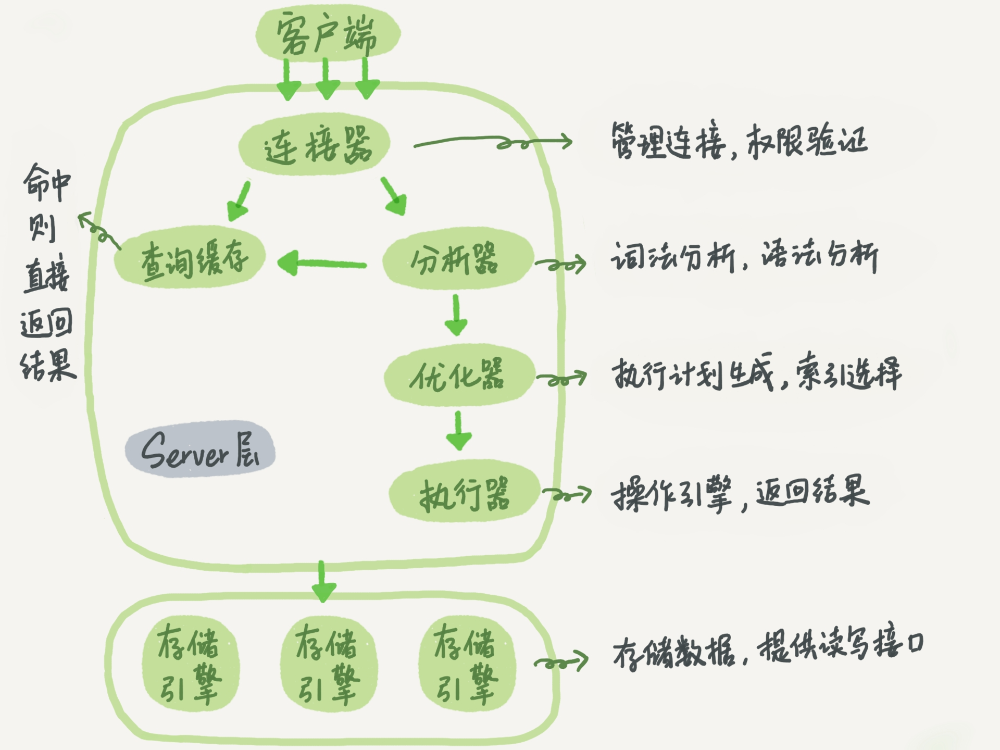

# MySQL的执行流程

> 本文章绝大部分来源极客时间的丁奇大神的MySQL实战专栏


## 总览(Outine)



一图胜千言.上图很好地展示了MySQL的执行流程.
下面,详细介绍一下.(图是从专栏中拿来用的,读书人的事,怎么能说偷呢!)

MySQL受到Oracle的很多影响.
其中执行流程和它类似.

MySQL有`服务端`(server)和`客户端`(client)

- 连接器(connnector),客户端的请求传过来,会先验证该用户是否有权限(登录连接)
- 缓存查询(cache),传来的SQL语句,会看看是否命中缓存(MySQL 8 之后,这一步没有了,因为得不偿失)
	- 命中,直接返回结果
	- 不命中,进行下一个分支
- 解析器(parser),会进行词法分析和语法分析.判断SQL语法是否正确
	- 正确,进入下一步
	- 不正确,提示Syntax Error,结束
- 优化器(optimiser),会根据SQL语句进行优化,选择高效的处理.
- 执行器(executor),判断权限,
	- 有权限,交给引擎处理.
	- 没有权限,返回失败信息.
- 引擎(engine)处理,MySQL默认是InnoDB.

## 连接器(Connector)

请求连接代码

```bash
mysql -h$ip -P$port -u$user -p
```

连接器,一条从客户端发来的请求,最起码得先看看是谁要请求的吧!
判断一下你的权限.
再不济,咋地也得验证一下账号密码啥的吧!

连接器就是做这一部分内容的.

权限的信息是在连接时就保存了.
所以,如果用户权限修改了.那也只能下一次登录才生效.

登录后,如果`空闲8小时`则会断开连接!
而有的Java ORM框架会保持长连接,但是框架认为连接还在,但是MySQL已经断开了!
会导致经典的`MySQL 8小时问题`.


## 查看缓存(cache)

缓存是个好东西,可以加快程序的响应速度.
但是在数据库层面,大部分是不好的.

因为数据库的更新都会导致数据库缓存的重写.
遇到更新就得重新写缓存.大部分是得不偿失的.

当然了,对于很少更新的表,使用缓存还是很好的.
不过,现在都有redis了,不比数据库快多了...

所以在高版本的MySQL中就去掉了缓存.


## 分析器(parser)

分析器,说白了就是看看你的SQL语句有没有啥问题.
如果你的SQL语句出现了bug.它就会告诉你,你的SQL语法存在问题.让你再看看!

```sql
SELECT * FROM t WHERE id=1
```

例如上面的SQL,如果表名t不存在,或者id字段不存在,就会报错!
有时候,SQL语句写的长了.有些小细节就容易错!分步写,就好很多.

## 优化器(optimizer)

优化器,这个就比较厉害了.会判断怎么执行SQL合适.根据索引,选择哪个索引,或者决定表的连接顺序等!

```sql
SELECT * FROM ta JOIN tb USING(id) where ta.a = 'a' AND tb.b = 'b'
```

上面的SQL语句,无论是先执行 ta.a='a' 还是 tb.b='b' 都是可以得到同样的效果的
但是先执行哪个,却很可能带来完全不同的效果!

例如如果tb.b就几行数据.ta有几百万行.那么先执行tb明显要快.

## 执行器(executor)

执行器,会根据用户的权限来判断是否执行SQL语句.

如果该用户并没有该表的权限,那么会返回错误信息.

然后,会交给数据库引擎处理.

## 数据库引擎(engine)

MySQL的数据库引擎是插件式的.有很多不同的选择.
现在的默认引擎是InnoDB,它支持事务,有redo_log可以crack-safe.
也有一些现在不常用的MyISAM和Memory.

我知道一个很不错的巨杉数据库,就是做的MySQL数据库引擎.

[MySQL引擎](http://c.biancheng.net/view/2418.html)

## 小结

MySQL的执行流程大概就是这样.
当然,这些都只是大致看一下.让我们能有一个简单的了解.
后面,会慢慢加深的!
