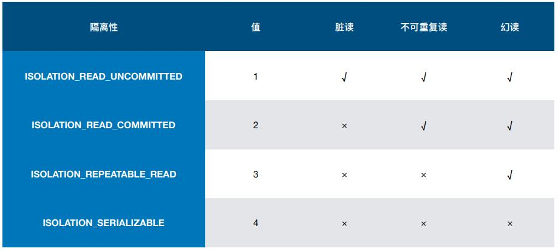
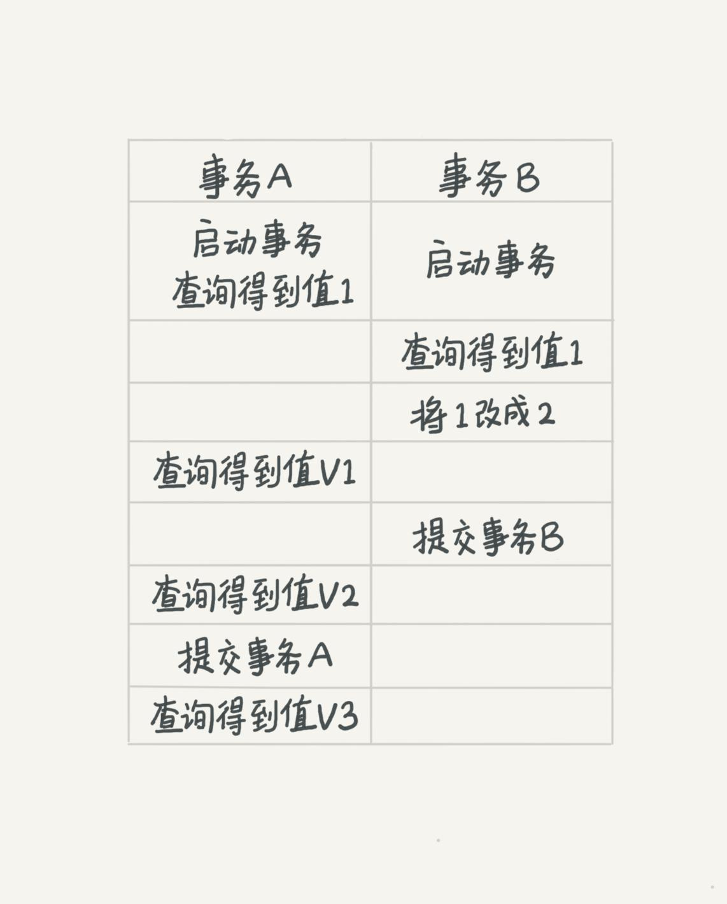
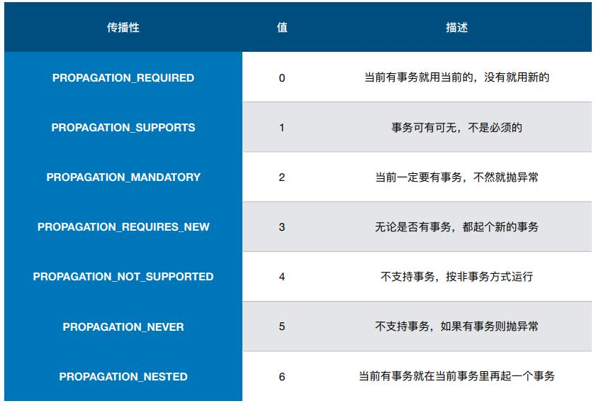

## MySQL的事务

谈到事务就离不开ACID

- Atomaticity 原子性
- Consistency 一致性
- Isolation   隔离性
- Durability  持久性

- 原子性,我们都比较熟悉.典型的例子就银行转账,不能别人转了钱了,但账户上没有扣除!那可就是血亏了!
- 一致性 [知乎上一篇讲的很好的文章](https://www.zhihu.com/question/31346392)
- 隔离性,就是多个事务之间的事情了,也是我们今天的主题
- 持久性,顾名思义,就是把数据固定到硬盘上.

但MySQL的事务是由引擎处理的,InnoBD支持.

## 事务的隔离机制

### 为什么要有事务的隔离

`肯定是要有的` 

- 如果说只有一个数据库连接来操作数据库的话,那么确实是不需要有事务的隔离级别的!
	- 当然了,数据库怎么可能只有一个连接来操作呢!!!

- 涉及到多个事务之间的操作,那么必须涉及到事务的隔离级别了.
	- 因为多个事务之间可能操作同一份数据.就很有可能出现问题!

> 让我不仅想起,Java中线程安全问题.单例模式中的共享可变变量...

### 事务隔离的级别

一说道`级别`,我最开始是迷惑的.我觉得把这个数据锁住,让其它连接修改不了不就行了吗?

这个可以,但没必要.

因为凡是简单的处理,那就以为着性能的消耗.低并发,高延迟.

假设一下,如果每个事务都这么做的话,效率会特别的低的.每个线程都得等待很久才能执行sql.
那具体有哪几个事务的隔离级别呢!

- Read Uncommitted：最低的隔离级别，什么都不需要做，一个事务可以读到另一个事务未提交的结果。所有的并发事务问题都会发生。
- Read Committed：只有在事务提交后，其更新结果才会被其他事务看见。可以解决脏读问题。
- Repeated Read：在一个事务中，对于同一份数据的读取结果总是相同的，无论是否有其他事务对这份数据进行操作，以及这个事务是否提交。可以解决脏读、不可重复读。 
- Serialization：事务串行化执行，隔离级别最高，牺牲了系统的并发性。可以解决并发事务的所有问题。

事务的隔离级别,需要根据业务场景不同选择!

但是长事务会导致性能的极大消耗.

`commit work and chain`

### 隔离级别对数据库的影响

- 脏读：事务A修改了一个数据，但未提交，事务B读到了事务A未提交的更新结果，如果事务A提交失败，事务B读到的就是脏数据。
- 不可重复读：在同一个事务中，对于同一份数据读取到的结果不一致。

事务B在事务A提交前读到的结果，和提交后读到的结果可能不同。
不可重复读出现的原因就是事务并发修改记录，要避免这种情况，
最简单的方法就是对要修改的记录加锁，这回导致锁竞争加剧，影响性能。
另一种方法是通过MVCC(多版本并发控制)可以在无锁的情况下，避免不可重复读。也就是事务级别为可重复读..

- 幻读：在同一个事务中，同一个查询多次返回的结果不一致。

事务A新增了一条记录，
事务B在事务A提交前后各执行了一次查询操作，发现后一次比前一次多了一条记录。幻读是由于并发事务增加记录导致的，
这个不能像不可重复读通过记录加锁解决，因为对于新增的记录根本无法加锁。需要将事务串行化，才能避免幻读。   
  

我们可以分别用不同的事务级别来考虑一下 v1,v2,v3的值

- Read Uncommitted 
	- v1:2 v2:2 v3:2
- Read Committed 
	- v1:1 v2:2 v3:2 
- Repeatable Read
	- v1:1 v2:1 v3:2 
- Serilazition
	- v1:1 v2:1 v3:2

## spring的事务

spring中的事务的使用,有上图的7中.最常用的,也就是默认的required.

spring的事务管理有声明式(使用注解)和编程式的.

其中声明式的使用较多,因为这样方便简单.而且不影响代码逻辑.但是必须抛异常!

但要注意注解的使用,是必须加在public方法上的.而且必须抛出RuntimeException(也可以指定抛出的异常);
一旦try catch 吞掉了异常,那么事务是无法回滚的!

我写了一篇文章,记录了一下我踩过的坑

另外,如果公司没有使用spring提供的事务管理,那么一定要问清楚,如何处理事务.不要想当然!

[spring事务无法回滚](https://blog.csdn.net/qq_34120430/article/details/88913679)

